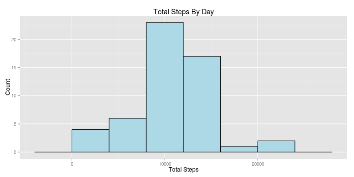
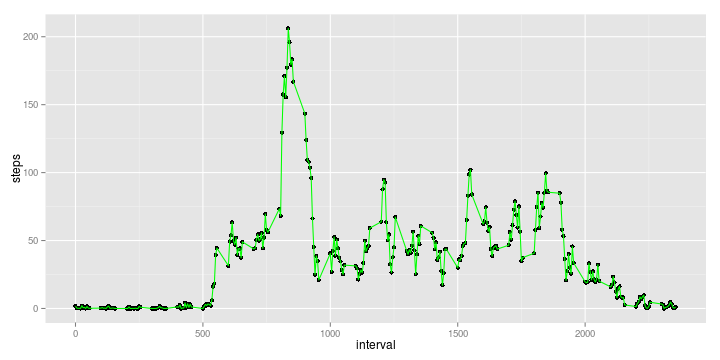
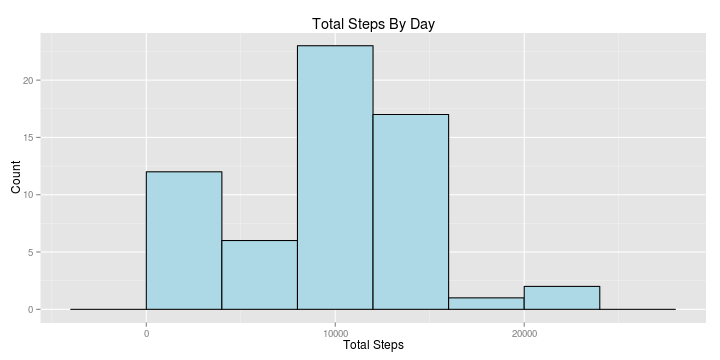
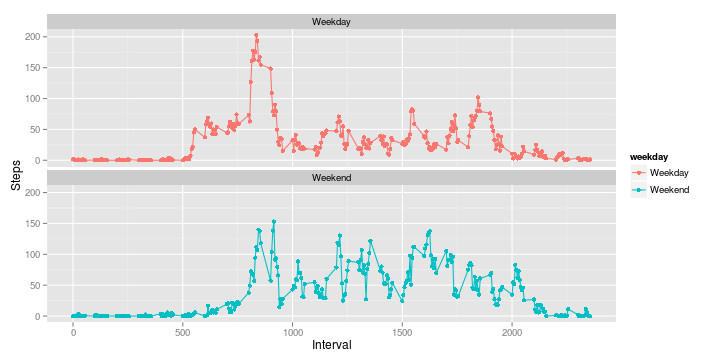

# Reproducible Research: Peer Assessment 1


## Loading and preprocessing the data
Let us load the activity.csv. While loading, we need to make sure na.strings is set right. After
loading the data, we will set the class for date to be DATE. 


```r
activitydf <- read.csv("activity.csv", na.strings=("NA"))
activitydf$date <- as.Date(activitydf$date)
```

## What is mean total number of steps taken per day?
We can use the aggregate function to compute the total number of steps taken by day. We can
use the hist() to create the histogram of total steps.


```r
totalStepsTakenByDay <- aggregate(steps ~ date, data = activitydf, FUN=sum)

q <- ggplot(totalStepsTakenByDay, aes(x=steps)) 
q <- q + geom_histogram(binwidth=4000, fill="lightblue", color="black") 
q <- q + labs(x="Total Steps", y = "Count", title="Total Steps By Day")
q
```

 

```r
meanSteps <- mean(totalStepsTakenByDay$steps)
medianSteps <- median(totalStepsTakenByDay$steps)
print(paste("The average number of steps taken per day is", 
            round(meanSteps, 3), "and the median of the steps per day is", 
            medianSteps))
```

```
## [1] "The average number of steps taken per day is 10766.189 and the median of the steps per day is 10765"
```

## What is the average daily activity pattern?
We can get the average steps by interval by computing the mean of the steps by interval, ignoring the dates. 


```r
avgStepsByInterval <- aggregate(steps ~ interval, data = activitydf, FUN=mean)

q <- ggplot(avgStepsByInterval, aes(x=interval, y=steps)) 
q <- q + geom_point() + geom_line(color="green")
q
```

 

```r
intervalWithMaxSteps <- avgStepsByInterval[which(
    avgStepsByInterval$steps == max(avgStepsByInterval$steps)),][[1]]

print(paste("Average max steps is seen at", intervalWithMaxSteps))
```

```
## [1] "Average max steps is seen at 835"
```


## Imputing missing values
Let us find the number of missing values


```r
t <- table(!is.na(activitydf$steps))
available <- t[[2]]
empty <- t[[1]]
t
```

```
## 
## FALSE  TRUE 
##  2304 15264
```

```r
print(paste0(round(empty*100/(empty + available), 3), 
             "% [", empty, " out of ", empty + available, 
             "] of values are empty"))
```

```
## [1] "13.115% [2304 out of 17568] of values are empty"
```

We will try to impute NAs by replacing them with the mean for the interval multiplied by the ratio of that day's average to daily average.


```r
activityImputed <- data.frame(steps = integer(0), date = as.Date(character(0)), interval=integer(0))

avgSteps = mean(totalStepsTakenByDay$steps)

# Find all NAs 
for (i in 1:nrow(activitydf)) {
    row = activitydf[i,]
    if (is.na(row$steps)) {
        # Find the mean for the interval
        intervalMean <- avgStepsByInterval[which(avgStepsByInterval$interval == row$interval),]
        dailyMean <- totalStepsTakenByDay[which(totalStepsTakenByDay$date == row$date),]
        
        if (nrow(intervalMean)) {
            intervalMean <- intervalMean[["steps"]];
        } else {
            intervalMean <- 0
        }
        
        if (nrow(dailyMean)) {
            dailyMean <- dailyMean[["steps"]];
        } else {
            dailyMean <- 0;
        }
        
        row$steps = intervalMean * dailyMean / avgSteps
    }    
    activityImputed <- rbind(row, activityImputed)
}

adjustedTotalStepsTakenByDay <- aggregate(steps ~ date, data = activityImputed, FUN=sum)

q <- ggplot(adjustedTotalStepsTakenByDay, aes(x=steps)) 
q <- q + geom_histogram(binwidth=4000, fill="lightblue", color="black") 
q <- q + labs(x="Total Steps", y = "Count", title="Total Steps By Day")
q
```

 

```r
adjustedMeanSteps <- mean(adjustedTotalStepsTakenByDay$steps)
adjustedMedianSteps <- median(adjustedTotalStepsTakenByDay$steps)
print(paste("The adjusted average number of steps taken per day is", 
            round(adjustedMeanSteps, 3), "and the adjusted median of the steps per day is", 
            adjustedMedianSteps))
```

```
## [1] "The adjusted average number of steps taken per day is 9354.23 and the adjusted median of the steps per day is 10395"
```

We can see that both the mean and median values of the steps taken per day has gone down. This indicates that most of the values that were not present are during the low-activity interval. 

## Are there differences in activity patterns between weekdays and weekends?

Let us compute the day of the week for each day in our dataset.


```r
activityImputed$day <- weekdays(activityImputed$date, abbr=T)
activityImputed$day <- as.factor(activityImputed$day)

activityImputed$weekday <- sapply(activityImputed$day, 
                                  function(x) { if (x %in% c("Mon", "Tue", "Wed", "Thu", "Fri")) 
                                      "Weekday" else "Weekend"})
activityImputed$weekday <- as.factor(activityImputed$weekday)

weekdayAggregate <- aggregate(steps ~ interval * weekday, data = activityImputed, FUN=mean)

q <- ggplot(weekdayAggregate, aes(x=interval, y=steps, color=weekday, group=weekday)) 
q <- q + geom_point() + geom_line() 
q <- q + facet_wrap(~ weekday, ncol=1) + labs(x="Interval", y="Steps")
q
```

 

We can conclude from the previous graphs that there is a difference in activity between weekdays and weekends. In weekdays, the most amount of walking happens only during the morning commute while on the weekends, it is spread throughout the day.
